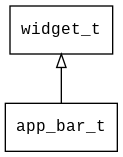

## app\_bar\_t
### 概述


app_bar控件。
一个简单的容器控件，一般在窗口的顶部，用于显示本窗口的状态和信息。
它本身不提供布局功能，仅提供具有语义的标签，让xml更具有可读性。
子控件的布局可用layout\_children属性指定。
请参考[布局参数](https://github.com/zlgopen/awtk/blob/master/docs/layout.md)。
app\_bar\_t是[widget\_t](widget_t.md)的子类控件，widget\_t的函数均适用于app\_bar\_t控件。
在xml中使用"app\_bar"标签创建app\_bar。如：
```xml
<app_bar x="0" y="0" w="100%" h="30" >
<label x="0" y="0" w="100%" h="100%" text="Basic Controls" />
</app_bar>
```
在c代码中使用函数app\_bar\_create创建app\_bar。如：
```c
widget_t* app_bar = app_bar_create(win, 0, 0, 320, 30);
```
可用通过style来设置控件的显示风格，如背景颜色等。如：
```xml
<style name="default" border_color="#a0a0a0">
<normal     bg_color="#f0f0f0" />
</style>
```

----------------------------------
### 函数
<p id="app_bar_t_methods">

| 函数名称 | 说明 | 
| -------- | ------------ | 
| <a href="#app_bar_t_app_bar_cast">app\_bar\_cast</a> | 转换为app_bar对象(供脚本语言使用)。 |
| <a href="#app_bar_t_app_bar_create">app\_bar\_create</a> | 创建app_bar对象 |
#### app\_bar\_cast 函数
-----------------------

* 函数功能：

> <p id="app_bar_t_app_bar_cast">转换为app_bar对象(供脚本语言使用)。


* 函数原型：

```
widget_t* app_bar_cast (widget_t* widget);
```

* 参数说明：

| 参数 | 类型 | 说明 |
| -------- | ----- | --------- |
| 返回值 | widget\_t* | app\_bar对象。 |
| widget | widget\_t* | app\_bar对象。 |
#### app\_bar\_create 函数
-----------------------

* 函数功能：

> <p id="app_bar_t_app_bar_create">创建app_bar对象


* 函数原型：

```
widget_t* app_bar_create (widget_t* parent, xy_t x, xy_t y, wh_t w, wh_t h);
```

* 参数说明：

| 参数 | 类型 | 说明 |
| -------- | ----- | --------- |
| 返回值 | widget\_t* | 对象。 |
| parent | widget\_t* | 父控件 |
| x | xy\_t | x坐标 |
| y | xy\_t | y坐标 |
| w | wh\_t | 宽度 |
| h | wh\_t | 高度 |
